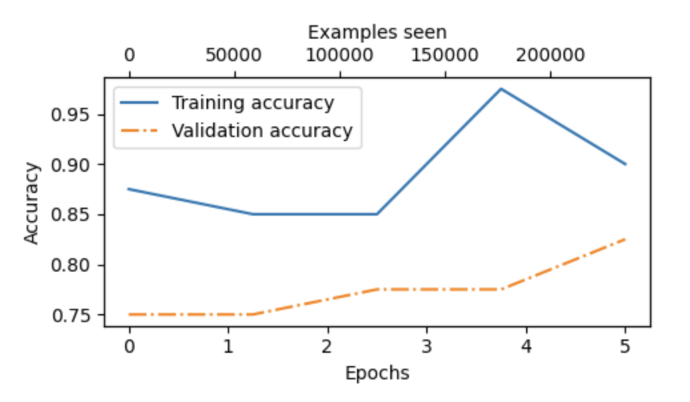
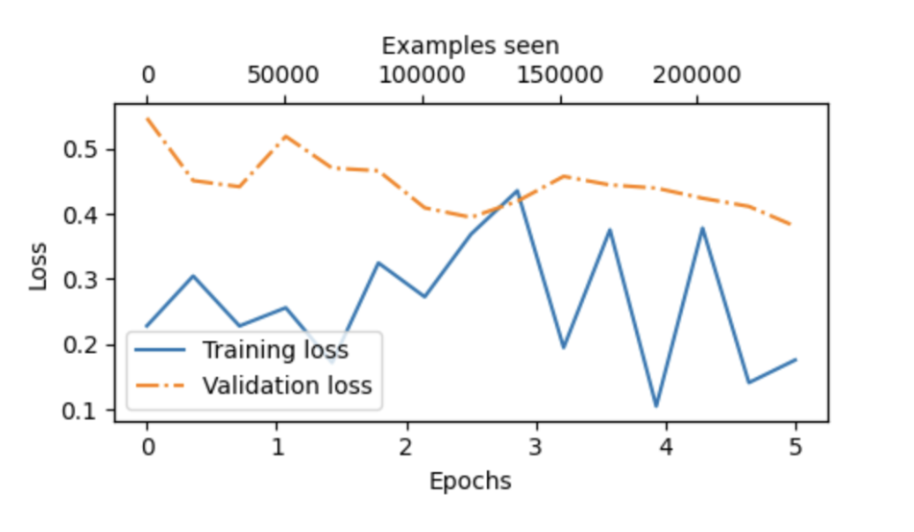
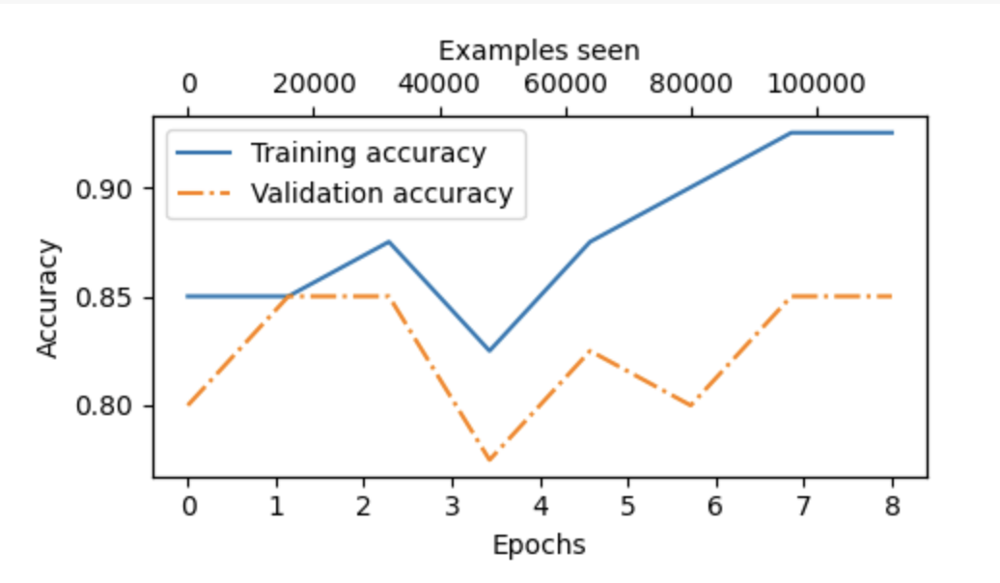
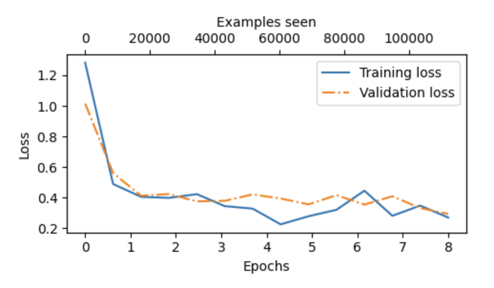
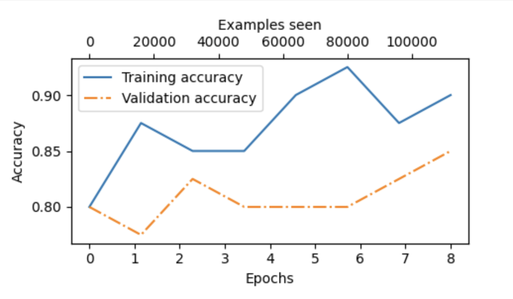
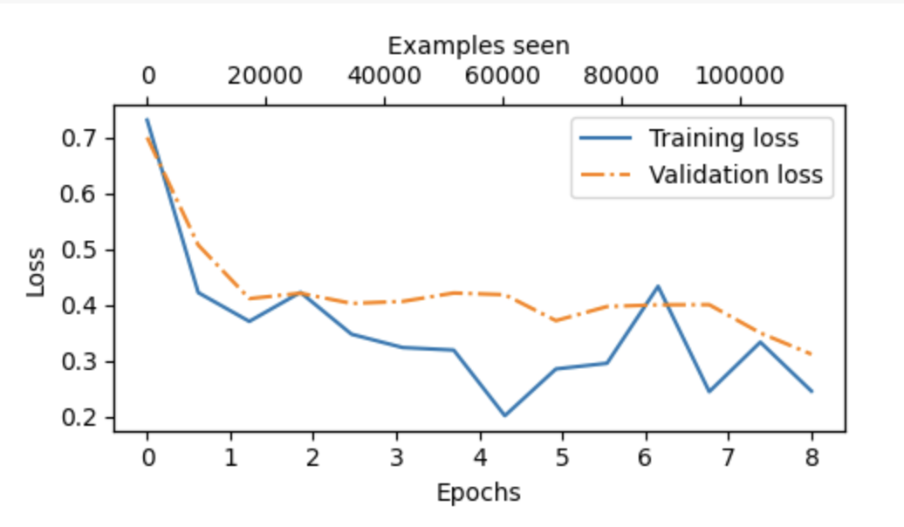
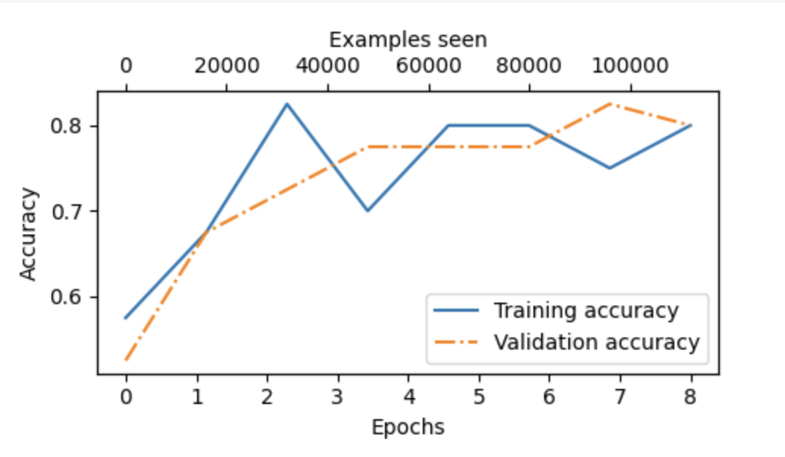
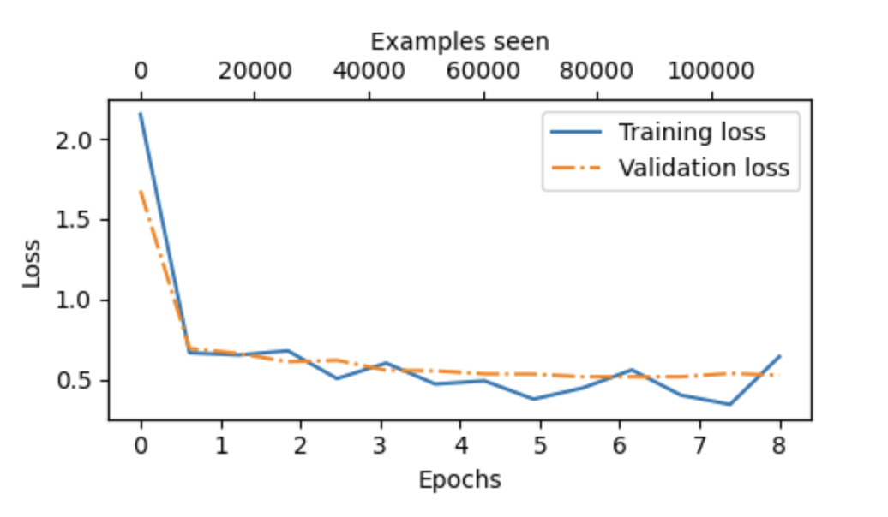
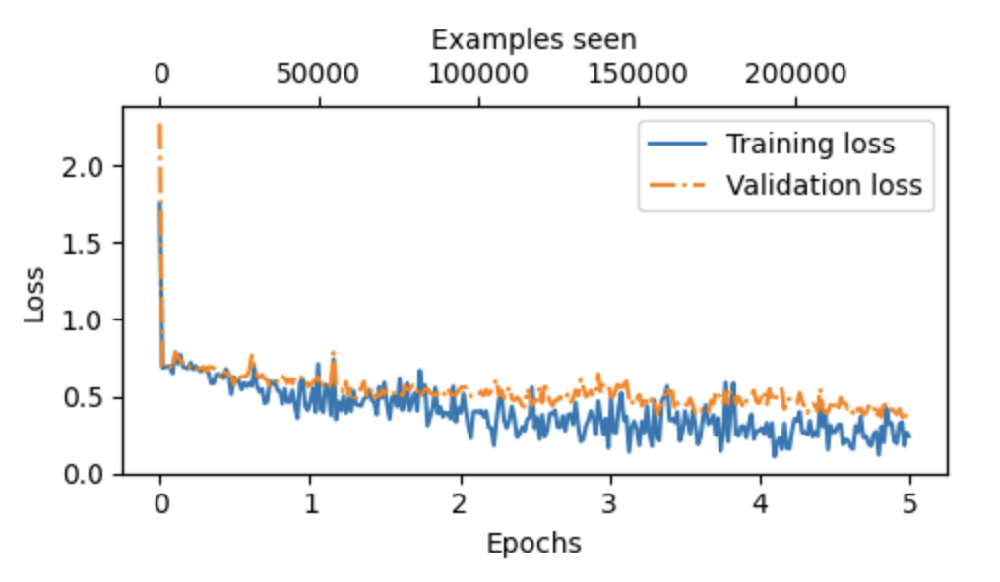

# GPT-2 Implementation and Fine-tuning for Sentiment Classification

This project implements GPT-2 from scratch and fine-tunes it on the SST-2 dataset for binary sentiment classification.

## Model Implementation Details
- Built complete GPT-2 architecture from scratch:
  - Multi-head self-attention mechanism
  - Position embeddings
  - Token embeddings
  - Layer normalization
  - Feed-forward networks
  - Transformer blocks
- Model size: 124M parameters
- Implemented in PyTorch with no use of pre-built transformer libraries

This project fine-tunes GPT-2 on the SST-2 (Stanford Sentiment Treebank) dataset for binary sentiment classification.

## Model Architecture
- Base model: GPT-2 (124M parameters)
- Fine-tuned layers: Last transformer block and final norm layer
- Classification head: Linear layer (768 → 2)

## Dataset
- SST-2 (Stanford Sentiment Treebank)
- Binary classification (positive/negative)
- Split: 70% train, 10% validation, 20% test
- 
## Experiments and Results
### Baseline Model

#### Configuration:

- Epochs: 5
- Optimizer: AdamW
- Learning rate: 1e-4
- Weight decay: 0.01
- Batch size: 8

## Results 
### Base Model

### Before Fine-tuning
- Training accuracy: 55.00%
- Validation accuracy: 62.50%
- Test accuracy: 61.25%

### After Fine-tuning
- Training accuracy: 96.88%
- Validation accuracy: 87.50%
- Test accuracy: 93.75%

#### Accuracy Plot

#### Loss Plot

### Experiment 1: Added more data
Changes: 
- Number of examples = 10000 

#### Accuracy Plot

#### Loss Plot

- Training accuracy: 84.38%
- Validation accuracy: 81.25%
- Test accuracy: 93.75%

### Experiment 2: Adding Dropout (0.1) and more data
- add dropout layer (0.1) to the final layer 
- epoch = 8 
- number of examples = 10000
- lr=1e-4
#### Accuracy Plot

#### Loss Plot

- Training accuracy: 78.12%
- Validation accuracy: 81.25%
- Test accuracy: 90.62%

### Experiment 3: Lower Learning Rate

Changes:
- Reduced learning rate to 1e-5
- Kept other parameters same as Experiment 1

#### Accuracy Plot

#### Loss Plot

- Training accuracy: 68.75%
- Validation accuracy: 75.00%
- Test accuracy: 81.25%

### Using the LLM as Binary Sentiment Classification
Review: This movie was absolutely fantastic!
Sentiment: Positive
Confidence: 99.49%
Probabilities: Positive: 99.49%, Negative: 0.51%

Review: What a terrible waste of time.
Sentiment: Negative
Confidence: 86.95%
Probabilities: Positive: 13.05%, Negative: 86.95%

Review: The acting was okay, but the plot was confusing.
Sentiment: Negative
Confidence: 61.85%
Probabilities: Positive: 38.15%, Negative: 61.85%

## Fine-tuning with LoRA: 

- Training accuracy: 87.50%
- Validation accuracy: 83.75%
- Test accuracy: 91.25%

## Observations

- Adding dropout and increasing data reduced overfitting 
- Lower learning rate led to more stable training but lower performance
- Model shows high confidence on clear sentiment examples but appropriate uncertainty on mixed reviews
- Increasing number of batches led to lower performance 
- When increasing the number of unfrozen transformer layers from one to two:
  - Training accuracy reached 100% (overfitting)
  - Validation accuracy remained at 84.38%
  - Test accuracy increased to 96.88%
  - This pattern indicates clear overfitting, where additional model capacity led to memorization of training data rather than better generalization. While test accuracy improved, the perfect training accuracy suggests the model might not be robust to new, unseen data.

