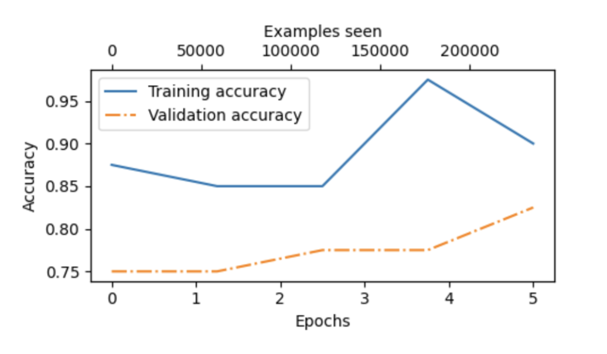

# GPT-2 Fine-tuning for Sentiment Classification

This project fine-tunes GPT-2 on the SST-2 (Stanford Sentiment Treebank) dataset for binary sentiment classification.

## Model Architecture
- Base model: GPT-2 (124M parameters)
- Fine-tuned layers: Last transformer block and final norm layer
- Classification head: Linear layer (768 → 2)

## Dataset
- SST-2 (Stanford Sentiment Treebank)
- Binary classification (positive/negative)
- Split: 70% train, 10% validation, 20% test

## Training Details
- Epochs: 5
- Optimizer: AdamW
- Learning rate: 1e-4
- Weight decay: 0.01
- Batch size: 8
- Training time: 19.03 minutes

## Results
### Before Fine-tuning
- Training accuracy: 55.00%
- Validation accuracy: 62.50%
- Test accuracy: 61.25%

### After Fine-tuning
- Training accuracy: 96.88%
- Validation accuracy: 87.50%
- Test accuracy: 93.75%

### Training Progress
- Epoch 1: Val acc 82.50%, Train acc 92.50%
- Epoch 2: Val acc 80.00%, Train acc 87.50%
- Epoch 3: Val acc 85.00%, Train acc 90.00% 
- Epoch 4: Val acc 85.00%, Train acc 92.50%
- Epoch 5: Val acc 85.00%, Train acc 92.50%

### Using the LLM as Binary Sentiment Classification
Review: This movie was absolutely fantastic!
Sentiment: Positive
Confidence: 99.49%
Probabilities: Positive: 99.49%, Negative: 0.51%

Review: What a terrible waste of time.
Sentiment: Negative
Confidence: 86.95%
Probabilities: Positive: 13.05%, Negative: 86.95%

Review: The acting was okay, but the plot was confusing.
Sentiment: Negative
Confidence: 61.85%
Probabilities: Positive: 38.15%, Negative: 61.85%

